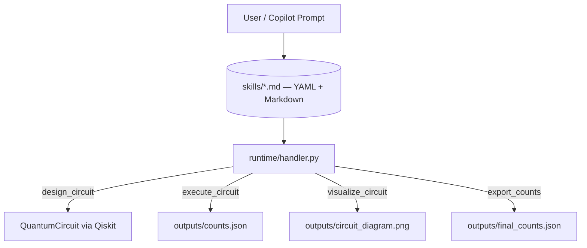

# Declarative Agent Loop: Running Quantum Experiments Without Touching Python

After exploring agentic platform engineering with Terraform module expert agents and skills, I was inspired to apply the same agent-skill orchestration pattern to quantum computing. This post demonstrates how an orchestrator—powered by agents and skills—can manage quantum circuit workflows, making advanced experimentation accessible, reproducible, and automation-friendly for developers.


> **Principle:** Agents should edit configuration, not implementation.

Most articles about “agentic AI and quantum computing” talk about LLMs designing quantum circuits.

This post is about something far more practical: using an agent to control a configuration state machine, not execution logic. The agent edits YAML, the runtime executes deterministically, and artifacts are produced. This is the core of the Declarative Agent Loop Pattern.

*For developers comfortable with Python and Qiskit, and curious to see what “agentic AI” looks like in real quantum experiments—not just in trend reports. The tools: GitHub Copilot.*

---

## Why the Bell State is Quantum Computing’s 'Hello World'

If you’ve used Qiskit before, you already know the Bell state: two qubits, a Hadamard (`H` gate, which creates superposition), a CNOT (controlled-NOT gate, which entangles the qubits), and suddenly you’re staring at entanglement in a histogram.

**What is a Bell state? (simple explanation)**
The Bell state is the simplest example of **quantum entanglement**. It links two qubits so that they are no longer independent — measuring one instantly determines the state of the other. The expected measurement outcomes are only `00` or `11` (never `01` or `10`).

It’s the canonical starting point for quantum experimentation — and the perfect place to demonstrate a new way of running those experiments.

Although demonstrated with Qiskit, this pattern is not specific to quantum computing.

Although demonstrated with quantum experiments, this pattern generalizes to any parameterized workflow.

The agent is not controlling execution — it is controlling configuration. Any parameter-driven, script-executed workflow can be made agent-operable by introducing a YAML skill layer between configuration and code.

## The gap nobody is filling

If you search for “agentic AI and quantum computing,” you’ll mostly find two things: high-level forecasts about how these fields might converge, and dense academic papers on systems like QAgent or QUASAR that use LLMs to generate quantum assembly code from natural language.

What you won’t find is a straightforward tutorial for working developers—someone who already knows Qiskit—showing how to wire an agentic workflow into their existing quantum experiments using tools they already have.

This post fills that gap with a small proof-of-concept where Copilot drives a Qiskit workflow end-to-end, using skill files as the contract between the AI and the code. No new frameworks. No fine-tuned models. No cloud quantum hardware required.

---

## Who this is for

This post assumes you:

- Are comfortable writing Python
- Have run at least a basic Qiskit circuit (Bell state, GHZ, or similar)
- Have used GitHub Copilot in VS Code, at least casually

You do not need a background in AI agents, LLMs, or access to quantum hardware. Everything here runs on the Aer simulator locally.

---

## Why automate quantum experiments at all?

If you’ve spent time with Qiskit, you’ll recognize this loop:

1. Tweak the number of shots
2. Change the circuit type
3. Rename output files so you don’t overwrite the last run
4. Run the script again
5. Check the histogram and repeat

After a few dozen iterations, you don’t have experiments anymore — you have archaeology.

The pattern this proof-of-concept explores is simple: **separate what the workflow does from how it’s configured**. The Python code handles execution. YAML-driven skill files handle the parameters. And GitHub Copilot can orchestrate the loop—editing YAML, running the script, and verifying outputs—when given filesystem and terminal tool access.

---


## How this differs from academic agentic quantum work

Academic systems like QAgent use multi-agent LLMs to autonomously *synthesize* quantum circuits from natural language. QUASAR uses reinforcement learning to teach models to generate OpenQASM. These are sophisticated research systems.

This POC operates at a different level.

Copilot is the lab assistant, not the physicist.

It handles the repetitive outer loop — parameter changes, re-runs, artifact verification — while the quantum computation stays entirely in Python. That's a useful division of labor, and one that doesn't require any AI infrastructure beyond Copilot itself.

---

## Repository structure

```
agenticquantumbellstateagentskills/
├── AGENT.md                       # Agent instruction contract
├── runtime/
│   └── handler.py                 # Main pipeline execution script
├── agent_runtime/
│   ├── agent.py                   # Agent orchestration logic
│   ├── runtime.py                 # Supporting runtime logic
│   ├── skills_loader.py           # Loads skill files
│   ├── skill_parser.py            # Parses skill YAML/Markdown
│   └── __init__.py
├── skills/
│   ├── circuits/
│   │   ├── bell_state.md
│   │   ├── ghz_state.md
│   │   └── superposition.md
│   ├── execution/
│   │   ├── execute_circuit.md
│   │   └── measure_circuit.md
│   └── output/
│       ├── visualize_circuit.md
│       └── export_counts.md
└── outputs/                       # Generated artifacts land here
└── doc/                           # Documentation and blog files
```

**Folder roles:**
- `runtime/`: Main entry point(s) for running experiments (e.g., handler.py).
- `agent_runtime/`: Supporting modules for agent logic, skill loading, and parsing.

The design is intentionally simple. That’s what makes automation possible.

---

The contract: policy, intent, execution
This pattern is built on three layers:

AGENT.md defines policy (what the agent can and cannot do)
YAML defines intent (what the agent wants to change)
runtime defines execution (how changes are applied)
Contract guarantees for safe agent execution:

Every skill YAML is validated against a strict schema before execution
The runtime rejects unknown actions or parameters
No runtime modification of Python logic is allowed
All side effects are file-based only

## Skill files: the contract between Copilot and your code

#### Why YAML?
YAML is used as the agent interface because it constrains expressiveness. Unlike Python, it prevents structural logic changes, making it safe for LLM-driven modification. YAML is editable in natural language workflows (Copilot-friendly), supports human-readable diffs, and allows structured constraints without execution semantics. Other formats (JSON, TOML, DSLs) could work, but YAML is especially suited for agent editing.

#### YAML vs Tool APIs
YAML shifts orchestration complexity from the agent into the runtime, at the cost of flexibility. Tool APIs offer fine-grained operations but require more orchestration logic in the agent itself.

A skill file is a normal Markdown document with a YAML block at the top. The Markdown body is for you to read. The YAML frontmatter is for the runtime to execute.

Skills are organized into three types:
- `skills/circuits/` (e.g., `bell_state.md`, `ghz_state.md`)
- `skills/execution/` (e.g., `execute_circuit.md`, `measure_circuit.md`)
- `skills/output/` (e.g., `visualize_circuit.md`, `export_counts.md`)

Here is the execute circuit skill (actual YAML):

```markdown
---
action: execute_circuit
shots: 1024
backend: aer_simulator
constraints:
  min_shots: 256
  max_shots: 8192
  backend_locked: true
output_counts: outputs/counts.json
---
# Execute Circuit Skill

Runs the quantum circuit simulation using the Aer simulator.
- `shots`: Number of repetitions (default 1024). A "shot" is a single run of the quantum circuit followed by measurement. More shots give better statistics.
- `backend`: Always `aer_simulator` for this POC
- Output: Raw measurement counts saved to outputs/counts.json
```

**What does 'shots' mean in a Bell state experiment?**

A "shot" is a single run of the quantum circuit followed by measurement. Since quantum measurements are probabilistic, running many shots (e.g., 1024) lets you collect statistics and see the expected distribution of outcomes (like "00" and "11"). More shots give a clearer, more reliable picture of the quantum state's behavior.


The runtime reads `action:` to select a handler and treats the remaining keys as parameters. Changing experiments becomes a YAML edit, not a Python change.

This is the key to Copilot automation. Copilot can edit a text file. It cannot safely edit Python without risking logic errors. YAML is used as the agent interface because it constrains expressiveness. Unlike Python, it prevents structural logic changes, making it safe for LLM-driven modification. This is a clean, low-risk interface.

> **Principle:** Agents should edit configuration, not implementation.

---

## The full workflow


"S = Skill file, H = Handler

**Notation:**
- `shot`: One execution of the quantum circuit and measurement
- `H` (in circuit context): Hadamard gate (creates superposition)
- `CNOT`: Controlled-NOT gate (entangles qubits)
- `H` (in workflow diagram): Handler (runtime/handler.py)

> Note: `H` is used in two contexts. In quantum circuits, it means the Hadamard gate. In the workflow diagram, it means the Handler (the Python runtime/handler.py).


Each step in the workflow maps to one skill file. The runtime reads them in order, validates the YAML, and dispatches each action. Qiskit runs the actual quantum simulation — the agent runtime never touches the circuit logic.

---

## Running it yourself

Set up the environment on Linux or macOS:

```bash
cd quantum-circuit-expert
python -m venv .venv
source .venv/bin/activate
pip install -r requirements.txt
```

Run non-interactively:

```bash
python runtime/handler.py
```

---

### New: Batch Processing of Multiple Circuits

The handler now automatically detects and runs all available circuit skills (e.g., Bell, GHZ, Superposition) in one execution. Simply add or edit skill files in `skills/circuits/`, then run:

```bash
python runtime/handler.py
```

Outputs for each circuit (counts, diagrams) are saved with unique filenames in `outputs/`. This makes it easy to compare results across multiple experiments in a single run.

---

Two artifacts appear in `outputs/`:

- `counts.json` — measurement results across all shots (in `outputs/`)
- `circuit_diagram.png` — visual circuit diagram (in `outputs/`)

If you run with a different shot count or configuration, you may see additional files (e.g., `bell_diagram_dpi300.png`, `final_counts.json`). Screenshots for 64-shot variants are generated only after running with those parameters.
---

## Demo Results and Screenshots

### Bell State Circuit Diagram


### Measurement Results

```json
{
  "00": 33,
  "11": 31
}
```
The histogram shows only 00 and 11, ~50/50 — exactly what we expect from entanglement.

These measurement results are from a quantum Bell state experiment:
- "00": 33 means the outcome where both qubits are 0 was measured 33 times.
- "11": 31 means both qubits were 1 in 31 measurements.

This is expected for a Bell state, which creates entanglement. The results show nearly equal probability for "00" and "11", and almost never "01" or "10", demonstrating quantum entanglement between the two qubits.

---


---

## Experiments Run and Results

We tested a variety of quantum experiments using the declarative agentic pattern. Each experiment was defined in YAML and executed by the runtime, with results automatically saved and summarized:

| Experiment                    | Qubits | Description                                 | Results (probabilities)                | Entanglement |
|-------------------------------|--------|---------------------------------------------|----------------------------------------|--------------|
| bell_state                    | 2      | Bell state (entangled)                      | 00: 53%, 11: 47%                       | Yes          |
| ghz_state                     | 3      | GHZ state (multi-qubit entanglement)        | 000: 51%, 111: 49%                     | Yes          |
| custom_declarative            | 2      | Bell-like, fully declarative                | 00: 45%, 11: 55%                       | No           |
| single_qubit_superposition    | 1      | Single qubit in superposition               | 0: 44%, 1: 56%                         | No           |
| three_qubit_superposition     | 3      | All qubits in superposition (|+++⟩ state)   | 000: 17%, 001: 10%, 010: 18%, 011: 13%, 100: 12%, 101: 10%, 110: 10%, 111: 10% | No           |

Each result matches quantum theory expectations for the respective experiment. New experiments can be added by simply editing YAML—no Python changes required.

## This is where it becomes agentic

Once the non-interactive entrypoint exists, Copilot can execute a single declarative loop when prompted, but it does not maintain state or run autonomously. Here is an example prompt used in VS Code Copilot Chat with filesystem and terminal tool access enabled:

```
Using only filesystem + terminal tools on Linux:

1) Edit skills/execute_circuit.md YAML:
   - shots: 512
   - output_counts: outputs/counts.json

2) Run:
   cd agenticquantumbellstateagentskills &&
   source .venv/bin/activate &&
   python runtime/handler.py

3) Verify:
   test -s outputs/counts.json
   python -c "import json; print(json.load(open('outputs/counts.json')))"
   test -s outputs/circuit_diagram.png
```

**Note:** Each cycle is user- or prompt-initiated; there is no persistent agent memory. Steps may be skipped or partially executed if not explicitly prompted.

Three properties make this prompt effective:

It is entirely declarative — it describes the desired state, not a sequence of decisions.
Verification is built in: Copilot checks that the artifacts exist and have content before finishing.
The Python code was never touched. The workflow changed entirely through the YAML edit.

You can chain multiple such prompts to run a sweep across shot counts, compare output distributions, and archive results — all without writing a single loop in Python yourself.

---

## Changing circuit types without touching Python

Because circuit type is a YAML parameter, switching from Bell to GHZ is just a skill edit:

**`skills/circuits/ghz_state.md`:**
```yaml
---
action: design_circuit
circuit_type: ghz_state
qubits: 3
gates: [H, CNOT]
---
```

**`skills/output/export_counts.md`:**
```yaml
---
action: export_counts
circuit_type: ghz_state
expected_states: ["000", "111"]
# H = Hadamard, CNOT = controlled-NOT (explained in prose, not YAML)
---
```

Re-run `python runtime/handler.py` and you get a three-qubit GHZ circuit with the appropriate expected distribution. The runtime, the Python execution, and the Copilot prompt are all unchanged.

---

## What this pattern is — and what it isn't

**It is:**

- A minimal agentic runtime for parameterized quantum experiments
- Automation-friendly via a non-interactive CLI flag
- A clean separation between configuration (YAML skills) and implementation (Python/Qiskit)
- Usable today with tools most developers already have

**It is not:**

- A system that synthesizes circuits from natural language (see QAgent or QUASAR for that)
- A production benchmark harness or CI pipeline (though it's a natural building block for one)
- Dependent on cloud quantum hardware — everything runs on Aer simulator locally
- A replacement for understanding your circuits — the YAML still requires you to know what `shots`, `backend`, and `expected_states` mean

---

## The missing piece in most agent demos: AGENT.md

Without AGENT.md, Copilot is guessing. With it, Copilot is operating under rules. That’s the difference between “AI autocomplete” and “AI agent”.

This is the file that turns Copilot from “helpful autocomplete” into “bounded operator”.

The `AGENT.md` file is the contract for the AI agent. It tells Copilot (or any agent) which circuits exist, what parameters it can change, and what it must never touch. This is exactly like a Terraform module expert prompt: it defines the rules of the game, the allowed actions, and the constraints.

This is the same abstraction used in CI pipelines, Terraform modules, and policy-as-code systems: constrain behavior through declarative interfaces instead of controlling execution logic.

If you want reproducible, safe automation, always include an agent instruction file.

---

## Known limitations of this pattern

Even with a clean contract, real-world agentic workflows face challenges:

- **YAML drift:** Agents may introduce invalid keys, inconsistent schemas, or silent misconfigurations.
- **Execution mismatch:** YAML may specify constraints (e.g., `backend_locked: true`) that the runtime ignores or misinterprets.
- **Non-deterministic reruns:** Quantum simulators like Aer can yield different results unless random seeds are controlled.
- **Tooling fragility:** Copilot + terminal automation can skip steps, partially execute workflows, or fail silently on file checks.

### Execution consistency problem
Declarative agent loops fail most often not at the agent layer, but at runtime consistency—when execution results and configuration drift apart without explicit invalidation. Partial execution, stale outputs, or implicit caching can all break the contract.

In production, schema validation and strict action registries are essential to mitigate these risks.

---

## Three things this taught me

**Non-interactive entrypoints are not optional.** Any workflow you want to automate needs a flag that suppresses prompts and REPLs.

**YAML is a better agent interface than code.** Text configuration is far safer for an agent to edit than implementation logic.

**Copilot is the lab assistant, not the physicist.** It runs the loop while Python runs the science.

Once this structure exists, extending it becomes trivial.

## Natural next steps

## From Local Loops to Quantum-Ready Azure Infrastructure (Future Direction)

This POC is deliberately local and runs only on the Aer simulator. It does not yet cover cloud infrastructure provisioning (e.g., `Microsoft.Quantum/workspaces` via Bicep/Terraform), hybrid quantum-classical workloads, or submitting jobs to real hardware.

With the January 2026 release of the updated Quantum Development Kit (QDK) and its deep GitHub Copilot integration, the same "agents edit config, not code" principle could extend naturally. Skill files could target `backend: azure_quantum` with providers like Quantinuum’s free H2 Emulator. Your declarative pattern could then bridge local experimentation → agent-driven infrastructure-as-code → production hybrid workloads.


**Once skills exist, new experiments become new files — not new scripts.**


**Skill profiles** — Rather than editing the same four files repeatedly, create named experiment folders:

```
skills/experiments/
  bell_64shots/
  bell_1024shots/
  ghz_3qubit/
```

Each folder contains a complete set of skill files for one experiment configuration. Copilot can switch between profiles by pointing the loader at a different directory.

**Threshold-based analysis** — Add fields to the analyze skill YAML for automated pass/fail:

```yaml
---
action: export_counts
expected_states: ["00", "11"]
min_expected_prob: 0.45
max_other_prob: 0.05
---
```

The runtime checks measured probabilities against these thresholds and logs pass/fail. This turns every run into a lightweight regression test.

**CI validation matrix** — A script that iterates over all experiment profiles, runs each one, and checks artifacts. You now have a reproducible quantum experiment suite that runs in CI without any manual steps.

---


## Closing

What this really is

This is not a quantum computing pattern. It is a way of turning any script-based system into a declarative control surface for agents.

The agent is not controlling execution — it is controlling a configuration state machine. This is the core of the Declarative Agent Loop Pattern.

Once that boundary is clean, agents don’t need to understand your system—they only need permission to modify its inputs.

In this POC, that layer is YAML skill files. In your system, it might be something else.

But the principle is the same:

> **Agents should edit configuration, not implementation.**

## Source Code

The complete source code for this lab is available on GitHub:

🔗 [View on GitHub](https://github.com/Dhineshkumarganesan/agenticquantumbellstateagentskills)

Feel free to clone, fork, and raise issues!